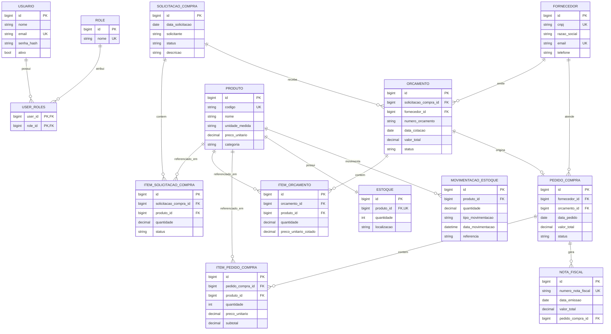

# ZLOG Compras — Estudo Situacional, Modelagem de Dados e Diagnóstico de Front-end

> Documento técnico-analítico produzido a partir da inspeção do repositório
> [`marciosouzagcm/ZLOG_COMPRAS`](https://github.com/marciosouzagcm/ZLOG_COMPRAS)
> (branch `master`, último commit relevante: `32aa38e — feat: corrige segurança JWT, CORS e integração do dashboard`, Dez/2025).
>
> Autor da análise: Lovable AI · Data: 17/05/2026

---

## Sumário

1. [Estudo Situacional do Projeto](#1-estudo-situacional-do-projeto)
2. [Modelagem de Dados](#2-modelagem-de-dados)
   - 2.1 [Modelo Conceitual](#21-modelo-conceitual)
   - 2.2 [Modelo Lógico](#22-modelo-lógico)
   - 2.3 [Modelo Físico (DDL sugerida)](#23-modelo-físico-ddl-sugerida-mysql-8)
   - 2.4 [Diagrama Entidade-Relacionamento (DER)](#24-diagrama-entidade-relacionamento-der)
   - 2.5 [Dicionário de Dados](#25-dicionário-de-dados-resumido)
3. [Diagnóstico do Front-end](#3-diagnóstico-do-front-end)
4. [Recomendações Gerais e Próximos Passos](#4-recomendações-gerais-e-próximos-passos)

---

## 1. Estudo Situacional do Projeto

### 1.1 Visão geral

O **ZLOG Compras** é um sistema **full-stack** voltado à gestão do ciclo
de **compras empresariais (Procure-to-Pay)** — da solicitação de
material até o recebimento e a nota fiscal. O escopo cobre:

- Solicitação de Compra
- Cotação / Orçamento com múltiplos fornecedores
- Aprovação de orçamento
- Geração de Pedido de Compra
- Recebimento e Nota Fiscal (em construção)
- Estoque e Movimentações de Estoque
- Autenticação JWT com perfis (Roles)

### 1.2 Arquitetura observada

```text
ZLOG_COMPRAS/
├── src/main/java/com/zlogcompras/
│   ├── controller/     (9 controllers REST)
│   ├── model/          (15 entidades + 6 enums + 30+ DTOs)
│   ├── ... (service, repository, security, etc.)
└── zlog_frontend/      (scaffold Vite + React 18 — vazio)
```

- **Backend:** Java 21 · Spring Boot 3.3.0 · Spring Data JPA / Hibernate · MySQL · Maven · Swagger/OpenAPI · JUnit (≈18 testes).
- **Frontend (README):** Angular standalone components.
- **Frontend (real no repo):** scaffold mínimo **Vite + React 18 + Axios**, sem código de aplicação versionado (apenas `package.json` e `package-lock.json`). Existe ainda uma subpasta `zlog-amigo-online/` aparentemente reservada a outro front-end.
- **Segurança:** correções recentes de **JWT + CORS** indicam que a autenticação é o eixo mais ativo nos últimos meses.

### 1.3 Maturidade por camada

| Camada                  | Status            | Evidência                                                                 |
|-------------------------|-------------------|---------------------------------------------------------------------------|
| Domínio / Modelo JPA    | **Avançado**      | 15 entidades, enums dedicados, versionamento otimista (`@Version`)        |
| API REST                | **Avançado**      | 9 controllers (Auth, Dashboard, Estoque, Fornecedor, Orcamento, Pedido, ProcessoCompra, Produto, Solicitacao) |
| Documentação            | **Boa**           | README detalhado + Swagger UI                                             |
| Testes                  | **Inicial**       | ~18 testes unitários, foco em Fornecedor e Orçamento                      |
| Banco de Dados          | **Médio**         | Mapeamentos JPA sólidos, **mas sem migrações versionadas (Flyway/Liquibase)** e com redundâncias (ex.: `Produto.codigo` + `Produto.codigo_produto`) |
| Front-end               | **Embrionário**   | README cita Angular, repositório contém apenas scaffold React vazio       |
| DevOps / CI-CD          | **Ausente**       | Sem workflows GitHub Actions, sem Dockerfile, sem `docker-compose`        |
| Observabilidade         | **Baixa**         | Logs locais (`logs/`, `hs_err_pid*.log`) e nada de APM/metrics            |

### 1.4 Pontos fortes

- Modelo de domínio **expressivo** e fiel ao processo P2P real.
- Uso correto de **DTOs por operação** (`RequestDTO`, `ResponseDTO`, `ListaDTO`, `InputDTO`).
- Adoção de **enums tipados** para status (evita "strings mágicas").
- Validação de regra de negócio relevante: bloqueio de novos orçamentos em solicitações finalizadas.
- Versionamento otimista (`@Version`) em quase todas as entidades.

### 1.5 Pontos críticos / riscos

1. **Ausência de migrações de banco** (Flyway/Liquibase). Tudo depende de `ddl-auto`, o que é inviável em produção.
2. **Inconsistência de stack de front-end** entre README (Angular) e código (React/Vite vazio + subpasta `zlog-amigo-online`).
3. **Estoque duplicado**: existe `Produto.estoque` (Integer) **e** entidade `Estoque` separada. Risco de divergência de saldo.
4. **`MovimentacaoEstoque` não referencia `Produto` por FK**, apenas por `codigoMaterial` (string), perdendo integridade referencial.
5. **`PedidoCompra.orcamento`** está mapeado com `@JoinColumn` mas **sem `@ManyToOne`** explícito no trecho lido — atenção a bug silencioso de mapeamento.
6. Arquivos como `hs_err_pid1912.log` e `replay_pid*.log` (crash da JVM) commitados na raiz — **devem ir para `.gitignore`**.
7. Sem CI, sem cobertura, sem análise estática (SpotBugs/SonarQube).
8. Segurança JWT recém-corrigida → revisar expiração, refresh tokens e rotação de secret.

---

## 2. Modelagem de Dados

O domínio foi reconstruído a partir das 15 entidades JPA encontradas em
`com.zlogcompras.model`. Os tipos seguem o que está no código-fonte.

### 2.1 Modelo Conceitual

Descrição em linguagem natural das **entidades** e **relacionamentos**:

- Um **Usuário** possui um ou mais **Papéis** (Roles: `ADMIN`, `COMPRADOR`, `SOLICITANTE`, etc.).
- Um **Usuário (solicitante)** abre uma **Solicitação de Compra**, que contém vários **Itens de Solicitação** (cada item referencia um **Produto** e uma quantidade).
- Para cada Solicitação podem existir vários **Orçamentos**, cada um emitido por um **Fornecedor**.
- Cada **Orçamento** contém vários **Itens de Orçamento** (preço cotado por produto).
- Um **Orçamento aprovado** dá origem a um **Pedido de Compra**, vinculado ao **Fornecedor** vencedor.
- O **Pedido de Compra** contém vários **Itens de Pedido**.
- O recebimento do Pedido produz uma **Nota Fiscal** e dispara **Movimentações de Estoque** (ENTRADA), atualizando o **Estoque** do Produto.
- Saídas e ajustes também geram **Movimentações de Estoque**.

```text
USUÁRIO ──< abre >── SOLICITAÇÃO_COMPRA ──< contém >── ITEM_SOLICITAÇÃO ──> PRODUTO
                              │
                              └──< recebe >── ORÇAMENTO ──> FORNECEDOR
                                                  │
                                                  └──< contém >── ITEM_ORÇAMENTO ──> PRODUTO
                                                  │
                                                  └──< origina >── PEDIDO_COMPRA ──> FORNECEDOR
                                                                       │
                                                                       ├──< contém >── ITEM_PEDIDO ──> PRODUTO
                                                                       │
                                                                       └──< gera >── NOTA_FISCAL
                                                                                          │
                                                                                          └──< dispara >── MOVIMENTAÇÃO_ESTOQUE ──> PRODUTO ──< possui >── ESTOQUE

USUÁRIO ──< user_roles >── ROLE
```

### 2.2 Modelo Lógico

Notação: `PK` = chave primária · `FK` = chave estrangeira · `UK` = chave única.

#### Entidades principais

**USUARIO** (`users`)
- `id` PK
- `nome`, `email` UK, `senha_hash`, `ativo`
- `data_criacao`, `data_atualizacao`, `version`

**ROLE** (`roles`)
- `id` PK
- `nome` UK (enum `RoleName`: `ROLE_ADMIN`, `ROLE_COMPRADOR`, …)

**USER_ROLES** (`user_roles`) — tabela associativa N:N
- `user_id` PK/FK → users.id
- `role_id` PK/FK → roles.id

**PRODUTO** (`produtos`)
- `id` PK
- `codigo` UK, `codigo_produto` UK *(redundância identificada — recomenda-se consolidar)*
- `nome`, `descricao`, `unidade_medida`, `categoria`
- `preco_unitario` DECIMAL(10,2)
- `estoque` INT *(saldo desnormalizado — ver observação em 1.5)*
- `data_criacao`, `data_atualizacao`, `version`

**FORNECEDOR** (`fornecedores`)
- `id` PK
- `cnpj` UK(18), `razao_social`, `contato`, `email` UK, `endereco`, `telefone`
- `version`

**SOLICITACAO_COMPRA** (`solicitacoes_compra`)
- `id` PK
- `data_solicitacao` DATE
- `solicitante` *(string — poderia ser FK p/ `users`)*
- `status` ENUM (`StatusSolicitacaoCompra`)
- `descricao`
- `data_criacao`, `data_atualizacao`, `version`

**ITEM_SOLICITACAO_COMPRA** (`itens_solicitacao_compra`)
- `id` PK
- `solicitacao_compra_id` FK → solicitacoes_compra.id
- `produto_id` FK → produtos.id
- `quantidade` DECIMAL(10,3)
- `descricao_adicional`
- `status` ENUM (`StatusItemSolicitacao`)
- `data_criacao`, `data_atualizacao`, `version`

**ORCAMENTO** (`orcamentos`)
- `id` PK
- `solicitacao_compra_id` FK → solicitacoes_compra.id
- `fornecedor_id` FK → fornecedores.id
- `numero_orcamento`, `data_cotacao` DATE
- `valor_total` DECIMAL(12,2)
- `prazo_entrega`, `condicoes_pagamento`, `observacoes`
- `status` ENUM (`StatusOrcamento`)
- `data_criacao`, `data_atualizacao`, `version`

**ITEM_ORCAMENTO** (`itens_orcamento`)
- `id` PK
- `orcamento_id` FK → orcamentos.id
- `produto_id` FK → produtos.id
- `nome_produto`, `codigo_produto`, `unidade_medida_produto` *(snapshot)*
- `quantidade` DECIMAL(10,3), `preco_unitario_cotado` DECIMAL(12,2)
- `observacoes`, `version`

**PEDIDO_COMPRA** (`pedidos_compra`)
- `id` PK
- `fornecedor_id` FK → fornecedores.id
- `orcamento_id` FK → orcamentos.id *(nullable se o pedido não vier de cotação)*
- `data_pedido` DATE, `valor_total` DECIMAL(12,2)
- `status` ENUM (`StatusPedidoCompra`)
- `observacoes`

**ITEM_PEDIDO_COMPRA** (`itens_pedido_compra`)
- `id` PK
- `pedido_compra_id` FK → pedidos_compra.id
- `produto_id` FK → produtos.id
- `quantidade` INT, `preco_unitario` DECIMAL(12,2), `subtotal` DECIMAL(12,2)
- `nome_produto`, `codigo_produto`, `unidade_medida` *(snapshot)*
- `observacoes`, `version`

**NOTA_FISCAL** (`notas_fiscais`)
- `id` PK
- `numero_nota_fiscal` UK, `data_emissao` DATE
- `valor_total` DECIMAL(12,2)
- `pedido_compra_id` FK → pedidos_compra.id

**ESTOQUE** (`estoques`)
- `id` PK
- `produto_id` FK → produtos.id (recomenda-se **UNIQUE** para 1:1)
- `quantidade` INT, `localizacao`
- `data_ultima_entrada`, `data_ultima_saida`, `observacoes`
- `data_criacao`, `data_atualizacao`, `version`

**MOVIMENTACAO_ESTOQUE** (`movimentacoes_estoque`)
- `id` PK
- `codigo_material` *(recomenda-se substituir por `produto_id` FK)*
- `quantidade` DECIMAL(10,3)
- `tipo_movimentacao` ENUM (`TipoMovimentacaoEstoque`: `ENTRADA`/`SAIDA`/`AJUSTE`)
- `data_movimentacao` DATETIME
- `referencia` *(nº do pedido/NF/solicitação)*
- `version`

#### Cardinalidades

| Origem                  | Cardinalidade | Destino                |
|-------------------------|---------------|------------------------|
| Usuario                 | N : N         | Role                   |
| SolicitacaoCompra       | 1 : N         | ItemSolicitacaoCompra  |
| SolicitacaoCompra       | 1 : N         | Orcamento              |
| Fornecedor              | 1 : N         | Orcamento              |
| Orcamento               | 1 : N         | ItemOrcamento          |
| Produto                 | 1 : N         | ItemSolicitacaoCompra  |
| Produto                 | 1 : N         | ItemOrcamento          |
| Produto                 | 1 : N         | ItemPedidoCompra       |
| Produto                 | 1 : 1         | Estoque                |
| Produto                 | 1 : N         | MovimentacaoEstoque    |
| Orcamento               | 1 : 1         | PedidoCompra *(opc.)*  |
| Fornecedor              | 1 : N         | PedidoCompra           |
| PedidoCompra            | 1 : N         | ItemPedidoCompra       |
| PedidoCompra            | 1 : N         | NotaFiscal             |

### 2.3 Modelo Físico (DDL sugerida — MySQL 8)

```sql
CREATE TABLE produtos (
  id              BIGINT AUTO_INCREMENT PRIMARY KEY,
  codigo          VARCHAR(50)  NOT NULL UNIQUE,
  nome            VARCHAR(255) NOT NULL,
  descricao       TEXT,
  unidade_medida  VARCHAR(20)  NOT NULL,
  categoria       VARCHAR(50)  NOT NULL,
  preco_unitario  DECIMAL(10,2) NOT NULL,
  version         BIGINT,
  data_criacao     DATETIME NOT NULL,
  data_atualizacao DATETIME NOT NULL
) ENGINE=InnoDB;

CREATE TABLE fornecedores (
  id            BIGINT AUTO_INCREMENT PRIMARY KEY,
  cnpj          VARCHAR(18)  NOT NULL UNIQUE,
  razao_social  VARCHAR(255) NOT NULL,
  contato       VARCHAR(255),
  email         VARCHAR(255) UNIQUE,
  endereco      VARCHAR(255) NOT NULL,
  telefone      VARCHAR(15),
  version       BIGINT
) ENGINE=InnoDB;

CREATE TABLE solicitacoes_compra (
  id               BIGINT AUTO_INCREMENT PRIMARY KEY,
  data_solicitacao DATE NOT NULL,
  solicitante      VARCHAR(255) NOT NULL,
  status           VARCHAR(40) NOT NULL,
  descricao        TEXT,
  version          BIGINT,
  data_criacao     DATETIME NOT NULL,
  data_atualizacao DATETIME NOT NULL
) ENGINE=InnoDB;

CREATE TABLE itens_solicitacao_compra (
  id                     BIGINT AUTO_INCREMENT PRIMARY KEY,
  solicitacao_compra_id  BIGINT NOT NULL,
  produto_id             BIGINT NOT NULL,
  quantidade             DECIMAL(10,3) NOT NULL,
  descricao_adicional    VARCHAR(255),
  status                 VARCHAR(40) NOT NULL,
  version                BIGINT,
  data_criacao           DATETIME NOT NULL,
  data_atualizacao       DATETIME NOT NULL,
  CONSTRAINT fk_isc_sc FOREIGN KEY (solicitacao_compra_id) REFERENCES solicitacoes_compra(id),
  CONSTRAINT fk_isc_pr FOREIGN KEY (produto_id) REFERENCES produtos(id)
) ENGINE=InnoDB;

CREATE TABLE orcamentos (
  id                    BIGINT AUTO_INCREMENT PRIMARY KEY,
  solicitacao_compra_id BIGINT NOT NULL,
  fornecedor_id         BIGINT NOT NULL,
  numero_orcamento      VARCHAR(100) NOT NULL,
  data_cotacao          DATE NOT NULL,
  valor_total           DECIMAL(12,2) NOT NULL,
  prazo_entrega         VARCHAR(100),
  condicoes_pagamento   VARCHAR(255),
  observacoes           TEXT,
  status                VARCHAR(40) NOT NULL,
  version               BIGINT,
  data_criacao          DATETIME NOT NULL,
  data_atualizacao      DATETIME NOT NULL,
  CONSTRAINT fk_orc_sc FOREIGN KEY (solicitacao_compra_id) REFERENCES solicitacoes_compra(id),
  CONSTRAINT fk_orc_fo FOREIGN KEY (fornecedor_id)         REFERENCES fornecedores(id),
  UNIQUE KEY uk_orc_num_forn (numero_orcamento, fornecedor_id)
) ENGINE=InnoDB;

CREATE TABLE itens_orcamento (
  id                    BIGINT AUTO_INCREMENT PRIMARY KEY,
  orcamento_id          BIGINT NOT NULL,
  produto_id            BIGINT NOT NULL,
  nome_produto          VARCHAR(255) NOT NULL,
  codigo_produto        VARCHAR(50),
  unidade_medida_produto VARCHAR(20),
  quantidade            DECIMAL(10,3) NOT NULL,
  preco_unitario_cotado DECIMAL(12,2) NOT NULL,
  observacoes           VARCHAR(255),
  version               BIGINT,
  CONSTRAINT fk_io_orc FOREIGN KEY (orcamento_id) REFERENCES orcamentos(id),
  CONSTRAINT fk_io_pr  FOREIGN KEY (produto_id)   REFERENCES produtos(id)
) ENGINE=InnoDB;

CREATE TABLE pedidos_compra (
  id            BIGINT AUTO_INCREMENT PRIMARY KEY,
  fornecedor_id BIGINT NOT NULL,
  orcamento_id  BIGINT NULL,
  data_pedido   DATE NOT NULL,
  valor_total   DECIMAL(12,2) NOT NULL,
  status        VARCHAR(40) NOT NULL,
  observacoes   TEXT,
  CONSTRAINT fk_pc_fo  FOREIGN KEY (fornecedor_id) REFERENCES fornecedores(id),
  CONSTRAINT fk_pc_orc FOREIGN KEY (orcamento_id)  REFERENCES orcamentos(id)
) ENGINE=InnoDB;

CREATE TABLE itens_pedido_compra (
  id               BIGINT AUTO_INCREMENT PRIMARY KEY,
  pedido_compra_id BIGINT NOT NULL,
  produto_id       BIGINT NOT NULL,
  quantidade       INT NOT NULL,
  preco_unitario   DECIMAL(12,2) NOT NULL,
  subtotal         DECIMAL(12,2) NOT NULL,
  nome_produto     VARCHAR(255),
  codigo_produto   VARCHAR(100),
  unidade_medida   VARCHAR(50),
  observacoes      VARCHAR(500),
  version          BIGINT,
  CONSTRAINT fk_ipc_pc FOREIGN KEY (pedido_compra_id) REFERENCES pedidos_compra(id),
  CONSTRAINT fk_ipc_pr FOREIGN KEY (produto_id)       REFERENCES produtos(id)
) ENGINE=InnoDB;

CREATE TABLE notas_fiscais (
  id                  BIGINT AUTO_INCREMENT PRIMARY KEY,
  numero_nota_fiscal  VARCHAR(60) NOT NULL UNIQUE,
  data_emissao        DATE NOT NULL,
  valor_total         DECIMAL(12,2) NOT NULL,
  pedido_compra_id    BIGINT NOT NULL,
  CONSTRAINT fk_nf_pc FOREIGN KEY (pedido_compra_id) REFERENCES pedidos_compra(id)
) ENGINE=InnoDB;

CREATE TABLE estoques (
  id                 BIGINT AUTO_INCREMENT PRIMARY KEY,
  produto_id         BIGINT NOT NULL UNIQUE,
  quantidade         INT NOT NULL,
  localizacao        VARCHAR(120),
  data_ultima_entrada DATETIME,
  data_ultima_saida   DATETIME,
  observacoes        VARCHAR(255),
  version            BIGINT,
  data_criacao       DATETIME NOT NULL,
  data_atualizacao   DATETIME NOT NULL,
  CONSTRAINT fk_est_pr FOREIGN KEY (produto_id) REFERENCES produtos(id)
) ENGINE=InnoDB;

CREATE TABLE movimentacoes_estoque (
  id                 BIGINT AUTO_INCREMENT PRIMARY KEY,
  produto_id         BIGINT NOT NULL,
  quantidade         DECIMAL(10,3) NOT NULL,
  tipo_movimentacao  VARCHAR(20) NOT NULL,
  data_movimentacao  DATETIME NOT NULL,
  referencia         VARCHAR(100),
  version            BIGINT,
  CONSTRAINT fk_me_pr FOREIGN KEY (produto_id) REFERENCES produtos(id)
) ENGINE=InnoDB;

CREATE TABLE users (
  id       BIGINT AUTO_INCREMENT PRIMARY KEY,
  nome     VARCHAR(120) NOT NULL,
  email    VARCHAR(180) NOT NULL UNIQUE,
  senha_hash VARCHAR(255) NOT NULL,
  ativo    BOOLEAN NOT NULL DEFAULT TRUE,
  data_criacao DATETIME NOT NULL,
  data_atualizacao DATETIME NOT NULL,
  version  BIGINT
) ENGINE=InnoDB;

CREATE TABLE roles (
  id   BIGINT AUTO_INCREMENT PRIMARY KEY,
  nome VARCHAR(40) NOT NULL UNIQUE
) ENGINE=InnoDB;

CREATE TABLE user_roles (
  user_id BIGINT NOT NULL,
  role_id BIGINT NOT NULL,
  PRIMARY KEY (user_id, role_id),
  CONSTRAINT fk_ur_user FOREIGN KEY (user_id) REFERENCES users(id),
  CONSTRAINT fk_ur_role FOREIGN KEY (role_id) REFERENCES roles(id)
) ENGINE=InnoDB;
```

> **Recomendação:** versionar essa DDL como `V1__init.sql` em
> `src/main/resources/db/migration/` usando **Flyway**.

### 2.4 Diagrama Entidade-Relacionamento (DER)

Diagrama renderizável em qualquer visualizador Mermaid (incluindo o GitHub).



### 2.5 Dicionário de Dados (resumido)

| Tabela                    | Coluna chave de negócio       | Tipo            | Observação                                 |
|---------------------------|-------------------------------|-----------------|--------------------------------------------|
| `produtos`                | `codigo`                      | VARCHAR(50) UK  | Consolidar com `codigo_produto`            |
| `fornecedores`            | `cnpj`                        | VARCHAR(18) UK  | Validar dígitos verificadores              |
| `solicitacoes_compra`     | `status`                      | ENUM string     | `PENDENTE`, `EM_COTACAO`, `APROVADA`, `CANCELADA`, `FINALIZADA` |
| `orcamentos`              | `numero_orcamento`            | VARCHAR(100)    | UK composta com `fornecedor_id` |
| `orcamentos.status`       | —                             | ENUM string     | `PENDENTE`, `APROVADO`, `REPROVADO`, `EXPIRADO` |
| `pedidos_compra.status`   | —                             | ENUM string     | `EMITIDO`, `EM_ATENDIMENTO`, `RECEBIDO_PARCIAL`, `RECEBIDO_TOTAL`, `CANCELADO` |
| `movimentacoes_estoque`   | `tipo_movimentacao`           | ENUM string     | `ENTRADA`, `SAIDA`, `AJUSTE` |
| `notas_fiscais`           | `numero_nota_fiscal`          | VARCHAR(60) UK  | Validar máscara da SEFAZ                   |

---

## 3. Diagnóstico do Front-end

### 3.1 O que o README promete

- Angular (última versão, **Standalone Components**)
- TypeScript, SCSS, RxJS
- Tela de login funcional integrada ao backend via JWT

### 3.2 O que está realmente versionado

| Item                                                | Situação                                          |
|-----------------------------------------------------|---------------------------------------------------|
| Diretório Angular descrito no README (`frontend/`)  | **Não existe** no repositório                     |
| `ZLOG_COMPRAS/zlog_frontend/`                       | Apenas `package.json` + `package-lock.json`       |
| `package.json` desse scaffold                        | **Vite 4 + React 18 + Axios** (não Angular)       |
| Componentes, rotas, serviços, telas                 | **Nenhum** versionado                             |
| Subpasta `zlog-amigo-online`                        | Aparente segundo scaffold, **sem código fonte**   |
| Testes de UI / E2E                                  | Inexistentes                                      |
| Lint / Prettier                                     | Apenas ESLint default do scaffold                 |
| Build / CI                                          | Inexistente                                       |

### 3.3 Avaliação

- **Divergência grave de stack:** documentação fala de Angular, código aponta para React/Vite — isso confunde contribuidores e impede qualquer "primeira execução" reproduzível.
- **Cobertura efetiva: ~0 %** do escopo do produto está consumindo a API.
- O backend já expõe **9 controladores REST** prontos, mas **nenhuma tela** os consome de fato no repositório público.
- Não há **camada de serviços HTTP**, **store de estado**, **roteamento autenticado** ou **interceptors JWT**.
- Não há **design system** nem padronização visual (cores, tipografia, componentes).

### 3.4 Severidade

| Aspecto                            | Severidade |
|------------------------------------|------------|
| Inconsistência README × código     | Alta       |
| Ausência de telas funcionais       | Crítica    |
| Ausência de integração com a API   | Crítica    |
| Ausência de autenticação no cliente| Alta       |
| Ausência de testes/CI              | Média      |

### 3.5 Recomendação de stack para o front-end

Dado o estado atual (scaffold React vazio) e o ecossistema do mercado, recomendo **fixar uma decisão única**:

- **Opção A — React 18 + Vite + TypeScript + TailwindCSS + shadcn/ui + TanStack Query + React Router/TanStack Router + Axios + Zod.** Compatível com o scaffold já existente. Curva curta e produtividade alta.
- **Opção B — Angular 18 standalone**, conforme o README original, com Angular Material e NgRx Signals. Mantém a promessa documental.

> Em qualquer caso: atualizar **imediatamente** o `README.md` para refletir a stack realmente adotada.

---

## 4. Recomendações Gerais e Próximos Passos

### 4.1 Banco de dados (prioridade máxima)

1. Introduzir **Flyway** com `V1__init.sql` espelhando a DDL acima.
2. Eliminar redundância `produtos.codigo` ↔ `produtos.codigo_produto`.
3. Tornar `MovimentacaoEstoque.produto_id` uma **FK real** (remover `codigoMaterial` string).
4. Centralizar o **saldo** em `estoques.quantidade` e remover `produtos.estoque`; recomputar via triggers ou eventos de domínio.
5. Adicionar índices: `orcamentos(status, data_cotacao)`, `pedidos_compra(status, data_pedido)`, `movimentacoes_estoque(produto_id, data_movimentacao)`.
6. UK composta `(numero_orcamento, fornecedor_id)` em `orcamentos`.
7. Estratégia de **soft delete** (`deleted_at`) onde fizer sentido (Fornecedor, Produto).
8. Definir **política de auditoria** (`created_by`, `updated_by`) — hoje só há `solicitante` em texto.

### 4.2 Backend

1. Habilitar **Spring Security 6** com **refresh tokens** e rotação de chave.
2. Adicionar **Testcontainers** para testes de integração com MySQL real.
3. Configurar **Maven Surefire + JaCoCo** com meta mínima de 70 % de cobertura.
4. Adicionar **Docker Compose** (app + mysql + adminer) e **Dockerfile** multi-stage.
5. Criar workflow **GitHub Actions** (build, test, lint, push imagem).
6. Remover `hs_err_pid*.log` e `replay_pid*.log` do repositório e atualizar `.gitignore`.

### 4.3 Front-end

1. Decidir a stack (Angular **ou** React) e remover o scaffold não usado.
2. Implementar **AuthService + Interceptor JWT** e tela de login real.
3. Construir telas mínimas: Solicitações, Cotações, Pedidos, Fornecedores, Produtos, Estoque, Dashboard.
4. Definir **design system** (paleta, tipografia, componentes base).
5. Configurar **lint + prettier + commit hook** (Husky + lint-staged).
6. Adicionar **testes** (Vitest/Jest + Testing Library, ou Karma/Jest para Angular).

### 4.4 Roadmap sugerido (90 dias)

| Sprint | Foco                                          | Entrega                                       |
|--------|-----------------------------------------------|-----------------------------------------------|
| 1      | DB Migrations + correção de modelo            | Flyway V1, FK em movimentacoes, índices       |
| 2      | Segurança JWT consolidada                     | Login, refresh, RBAC nos endpoints            |
| 3      | Front-end base                                | Auth + layout + Produtos + Fornecedores       |
| 4      | Fluxo P2P no front                            | Solicitação → Cotação → Pedido                |
| 5      | Recebimento + NF + Estoque                    | Telas + integração com movimentações          |
| 6      | CI/CD + Observabilidade                       | GitHub Actions, Docker, métricas, logs        |

---

### Apêndice — Resumo executivo

> ZLOG Compras tem um **backend maduro** com modelo de domínio fiel ao processo de compras, **mas convive com três dívidas técnicas que o impedem de ir a produção**: (1) ausência de migrações de banco e pequenas inconsistências de modelo, (2) front-end inexistente no repositório apesar do README sugerir o contrário, e (3) ausência total de pipeline e observabilidade. Endereçar esses três eixos — começando pelo **banco de dados** (Flyway + correções de FK/redundância) — desbloqueia o projeto para evoluir com segurança.
